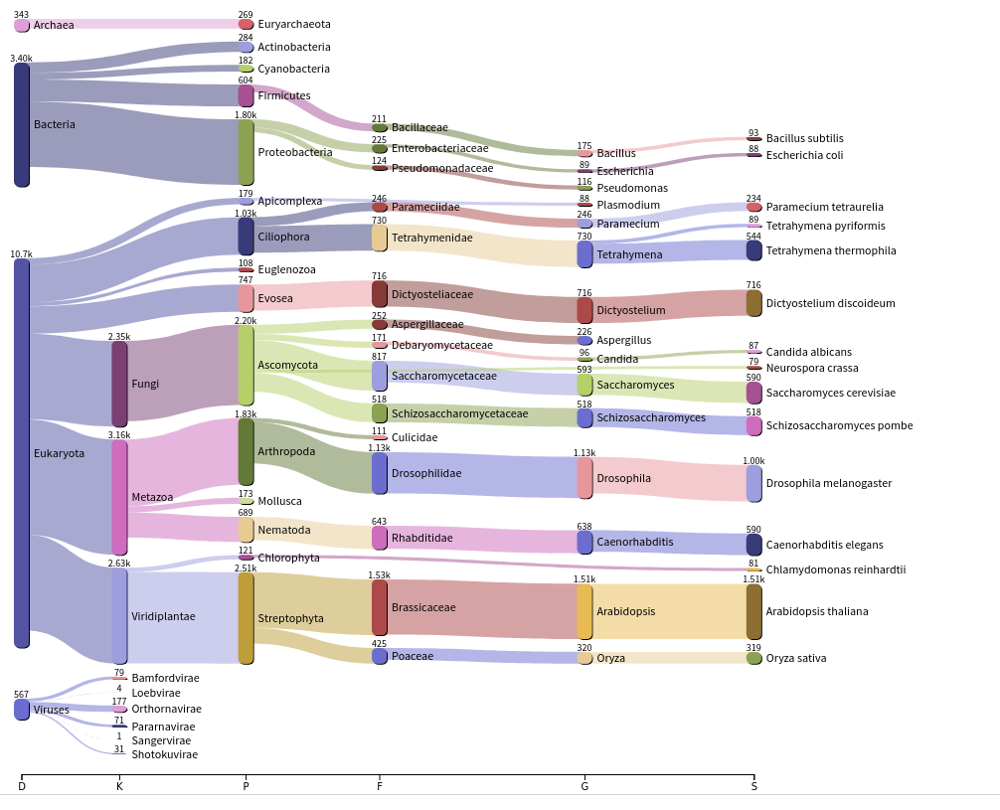

# Metatranscriptome analysis of *Eulimnogammarus verrucosus* microbiome

## Project description
The littoral amphipod *Eulimnogammarus verrucosus* is an endemic species of Lake Baikal. The exoskeleton of *E. verrucosus* is known to be the habitat of epibiont ciliates.
In the late summer and autumn of 2019, intensive fouling of amphipods by ciliates was observed, which led to the death of *E. verrucosus* individuals in the laboratory. Transcriptomic sequencing of *E. verrucosus* caught in September 2019, was performed. We hypothesized that the change in composition of the symbiotic community can be a reason for the death of animals. Preliminary microscopic analysis of the fouling confirmed that the epibiont belonged to ciliates.
We decided to assess the microbiome composition using: (1) 18S rRNA as a marker of biodiversity, and (2) coding RNA (metatranscriptome assembly).

## Goal and tasks

**Goal** 

The aim of the work is to analyze the symbiotic community of *E. verrucosus*.

**Tasks** 

- Get data on the composition of the symbiotic community;
- Compare the data with similar data for amphipods caught in previous years;
- Collect and annotate with a metatranscriptome to determine systematic position of the detected ciliates

## Methods
Sample with intensive fouling: F-100-BK-1, sample without intensive fouling Eve-B6.
For 18S rRNA biodiversity analysis were performed using BBDuk [1] with Silva [2] databases (Vortivella, Peritrichia, Ciliophora). 
For coding RNA we filter reads from assembly *E. verrucosus* muscle by BBDuk. Data corrected by Rcorrector [3]. The transcriptome assemblies were performed using three different tools (MEGAHIT [4], rnaSPAdes [5], and Trinity [6]). Quality control assemblies obtained with TransRate [7], BUSCO [8], and Bowtie 2 [9]. Duplicates were removed with CD-HIT [10, 11]. The annotation and taxonomic analysis were performed using MMseqs2 [12]. Reports were generated with Krona [13] and Pavian [14].
> A detailed report is [here in html format](report/workflow_report.html).

## Requirements
- BBDuk - 38.79
- Silva - SSU r138
- Rcorrector - v1.0.4
- MEGAHIT - v1.2.9
- rnaSPAdes - v3.14.0*
- Trinity - v2.8.5*
- TransRate - 1.0.3
- BUSCO - 4.0.6, databases: arthropoda_odb10, eukaryota_odb10, 
- Bowtie 2 - 2.1.0*
- CD-HIT - 4.6*
- MMseqs2 - 11.e1a1c*
- Pavian - 1.0.0, for report generating: R 3.6 Rstudio 1.2

Tools tested on Ubuntu 19.10,
*Tools tested on Ubuntu 14.04
## Results
**rRNA analysis**
| Сiliate | Eve_B6 | F-100-BK-1 |
| ------ | ------ | ------ |
| Vorticella | 1.0106 | 1.0570 |
| Peritrichia | 1.0147 | 1.0690 |
| Ciliophora | 1.0202 | 1.0961 |

**Metatranscriptome assembly**
Sample without fouling - Eve-B6

Sample with fouling - F100-BK-1

The diversity of Alveolata

The diversity of Ciliophora - unique genus for samples
| Eve_B6 | F-100-BK-1 |
| ------ | ------ |
| *Euplotes eurystomus* | *Glaucoma chattoni, Paramecium caudatum, Didinium nasutum, Condylostoma magnum, Blepharisma musculus* |

### Summary
As a result, (1) according to rRNA analysis, the number of ciliates has not changed: (2) the diversity of ciliates in the animal with fouling was bigger and included the following species: Glaucoma chattoni, Paramecium caudatum, Didinium nasutum, Condylostoma magnum, Blepharisma musculus. These species were not found in the animal sampled earlier. However, the changes occurring in the microbiome composition were minor. 

## References
1. BBMap – Bushnell B. – sourceforge.net/projects/bbmap/
2. Quast C, Pruesse E, Yilmaz P, Gerken J, Schweer T, Yarza P, Peplies J, Glöckner FO (2013) The SILVA ribosomal RNA gene database project: improved data processing and web-based tools. Nucl. Acids Res. 41 (D1): D590-D596.
3. Song, L., Florea, L., Rcorrector: Efficient and accurate error correction for Illumina RNA-seq reads. GigaScience. 2015, 4:48.
4. Li D, Liu CM, Luo R, Sadakane K, Lam TW. MEGAHIT: an ultra-fast single-node solution for large and complex metagenomics assembly via succinct de Bruijn graph. Bioinformatics. 2015;31(10):1674‐1676. doi:10.1093/bioinformatics/btv033.
5. Bushmanova E, Antipov D, Lapidus A, Prjibelski AD. rnaSPAdes: a de novo transcriptome assembler and its application to RNA-Seq data. Gigascience. 2019;8(9):giz100. doi:10.1093/gigascience/giz100.
6. Grabherr MG, Haas BJ, Yassour M, et al. Full-length transcriptome assembly from RNA-Seq data without a reference genome. Nat Biotechnol. 2011;29(7):644‐652. Published 2011 May 15. doi:10.1038/nbt.1883.
7. TransRate: reference free quality assessment of de-novo transcriptome assemblies (2016). Richard D Smith-Unna, Chris Boursnell, Rob Patro, Julian M Hibberd, Steven Kelly. Genome Research doi: http://dx.doi.org/10.1101/gr.196469.115.
8. Seppey M., Manni M., Zdobnov E.M. (2019) BUSCO: Assessing Genome Assembly and Annotation Completeness. In: Kollmar M. (eds) Gene Prediction. Methods in Molecular Biology, vol 1962. Humana, New York, NY. 2019 doi.org/10.1007/978-1-4939-9173-0_14.
9. Langmead B, Salzberg SL. Fast gapped-read alignment with Bowtie 2. Nat Methods. 2012;9(4):357‐359. Published 2012 Mar 4. doi:10.1038/nmeth.1923.
10. Cd-hit: a fast program for clustering and comparing large sets of protein or nucleotide sequences, Weizhong Li & Adam Godzik Bioinformatics, (2006) 22:1658-9.
11. Limin Fu, Beifang Niu, Zhengwei Zhu, Sitao Wu and Weizhong Li, CD-HIT: accelerated for clustering the next generation sequencing data. Bioinformatics, (2012), 28 (23): 3150-3152. doi: 10.1093/bioinformatics/bts565.
12. Steinegger M and Soeding J. MMseqs2 enables sensitive protein sequence searching for the analysis of massive data sets. Nature Biotechnology, doi: 10.1038/nbt.3988 (2017).
13. Ondov BD, Bergman NH, and Phillippy AM. Interactive metagenomic visualization in a Web browser. BMC Bioinformatics. 2011 Sep 30; 12(1):385.
14. Pavian: Interactive analysis of metagenomics data for microbiomics and pathogen identification Florian P. Breitwieser, Steven L. Salzberg; doi: https://doi.org/10.1101/084715.
